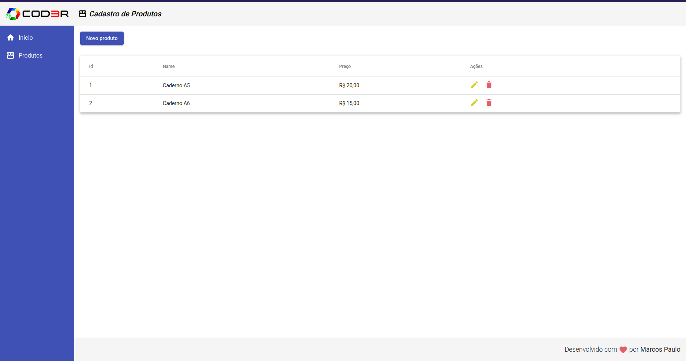

# CRUD Angular
Esse projeto foi desenvolvido durante o curso de Angular da [Cor3r](https://www.cod3r.com.br/)
O backend é apenas um json para simular as requisições http.

## Rodando localmente o backend

No diretório do projeto, na pasta backend
### `npm start`

## Rodando localmente o frontend

No diretório do projeto, na pasta frontend
### `npm start`

Depois de executar o backend e o frontend, basta abrir o navegador com [http://localhost:3000](http://localhost:3000)

## Imagem demonstrativa

